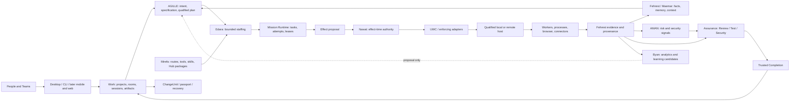

# Architecture reconciliation

STATUS = PROPOSED; no current code or governance effect. Read the [master](WEPLD_CANONICAL_MASTER_BUILD_PLAN.md).

## One-line architecture

Human intent enters Work and AGILLE; Fehrest supplies attributable context; Mirefa qualifies workers and packages; Edara staffs the minimum sufficient plan; Mission Runtime executes through UWC only after Nawat authorizes each effect; AMAN and independent Assurance produce evidence; Trusted Completion decides whether the exact outcome is acceptable; Work preserves delivery/recovery and Byan proposes measured improvements.

Boxes are logical ownership, not a microservice deployment prescription. The diagram is the target architecture; only S1/S2 and selected policy gates exist at the observed base.

## Reconciliation of inherited concepts

| Concept | Disposition | Single resulting meaning |
|---|---|---|
| Work / Case | KEEP | Work is product scope; Case is the existing issue/work record profile, not all domain work forced into an issue |
| AGILLE / Workflow Engine / Intent Compiler | MERGE | Definitions and planning; no second durable runtime |
| Mission / Task / Attempt | KEEP DISTINCT | Objective execution, bounded work unit, concrete execution try; a retry creates an Attempt |
| Edara / Agent Teams | KEEP | Staffing/topology proposals; organization membership belongs to Nawat/Work |
| Mirefa / provider catalog / Hub | MERGE | Qualified capabilities and package lifecycle; Hub listing is distribution, not qualification |
| Historical Hermes | SPLIT | Runtime host, UWC edge, Nawat authority; distinct from NousResearch Hermes and AutoClaw's learning feature |
| ContextCapsule / ContextPackage | MERGE | One ContextPackage identity with task/review/research profiles; no second memory store |
| Maemar / code graph / architecture maps | MERGE | Fehrest's structural/semantic intelligence; diagrams are projections |
| ReviewFinding / Finding | MERGE | ReviewFinding is an existing Finding projection |
| AuthorityGrant / NawatDecision | MERGE | Granting outcome of NawatDecision; not another grant database |
| EffectReceipt / EffectResult | MERGE | Execution result/evidence under the existing contract |
| TriggerEnvelope / RuntimeEvent | MERGE | Trigger payload, authenticated and deduplicated before intent admission |
| CapabilityPresence / SurfaceObservation | MERGE | Observation payloads, never qualification or grant |
| AMAN / Assurance | KEEP DISTINCT | Risk/security signals vs independent evaluation and findings |
| ReviewOutcome / CompletionDecision | KEEP DISTINCT | Producer's result vs governed acceptance of the exact outcome |
| Chronicle / cinema / forensics / timeline | MERGE | Evidence projections, causal queries and recovery views, not a competing event authority |
| ChangeStack / ChangeUnit / delivery | KEEP | One unit first, stack/graph breadth later; Git is not the full effect log |
| Canvas / design document | KEEP DISTINCT | Presentation projection and versioned authored artifact; no canvas state as policy truth |
| Live voice / meeting transcript | KEEP DISTINCT | Session input vs retained evidence; neither grants consent or task authority |
| External issue/chat/PR state | OBSERVATION | Provider revision/freshness/conflict recorded; provider close or merge does not complete Work |
| Old wepld/wepld code | HISTORICAL QUARRY | No directory copying; specific salvage requires present admission |

## Domain, consistency and field owners

Use existing [data-model](../data-model.md) for shared fields and the dedicated [contract index](../PLANNING_INDEX.md#2-normative-contract-package) for exceptions. All additional records below are semantic proposals to freeze at their owning task; they are not an instruction to create a universal database now.

Classes: AUTH = strongly consistent per authority scope; AGG = versioned aggregate with compare-and-set; EVID = append-only events and referenced payload generations; INDEX = rebuildable, freshness-tagged projection; DRAFT = user-editable proposal; EPHEMERAL = bounded presence/stream state. A signed record proves origin/integrity only, not factual correctness or authority.

| Contract family | Owner / writer | Readers / class / freeze task |
|---|---|---|
| Tenant, Organization, Team, Membership, Principal, role binding | Nawat administration | Work, all access consumers; AUTH; ASTRO-T01 |
| Project, Repository, WorkingCopy, branch/blob identity | Work/Core observation | Brain, Runtime, Assurance; AGG/EVID; ASTRO-F01 |
| Case, conversation, room, external binding | Work | AGILLE, Runtime, UI; AGG; ASTRO-F05/T02 |
| WorkSession durable association, identity and continuation | Mission Runtime, per existing data-model | Work/UI collaboration projection; AGG; ASTRO-F05/U01/W01 |
| WorkflowIntent, spec, PlanQualification, OutcomeCriteria | AGILLE | Edara, Assurance; DRAFT→AGG; ASTRO-F05 |
| Mission, Task, Attempt, assignment, lease, budget | Mission Runtime | Work, Edara, Nawat; AGG/EVID; ASTRO-F05 |
| WorkerRequirement, descriptor, model/provider/harness identity, route qualification | Mirefa | Edara, Runtime, Nawat; AGG; ASTRO-F05 |
| TopologyPlan, staffing proposal, delegation bound, review assignment | Edara | Runtime, Assurance; DRAFT→AGG; ASTRO-F05 |
| EffectProposal, NawatDecision, policy/grant epoch | Runtime proposes, Nawat decides | Enforcing adapters; AUTH/EVID; ASTRO-F06 |
| EffectResult, dependency, reconciliation, compensation | Enforcing adapter + Runtime | Completion, Work; EVID; ASTRO-F06/F08 |
| Server, Host, Runner, ProcessTreeIdentity, posture, ceiling, environment | S3 Runtime contracts | Nawat, Doctor; EVID; ASTRO-C01 |
| KnowledgeSource, collection, claim, memory, source generation | Fehrest | Context assembly, authorized readers; AGG/EVID; ASTRO-F03/F04 |
| Symbol/reference/call fact, semantic graph, branch-time lineage | Fehrest.Maemar | AGILLE, Assurance; INDEX plus source evidence; ASTRO-F03 |
| ContextPackage, retrieval/omission/budget/access evidence | Fehrest | Exact consumer and authorized reviewer; EVID; ASTRO-F04 |
| RuntimeEvent, action log, telemetry export | Runtime event owner | Work/Brain/Byan; EVID, telemetry INDEX; ASTRO-F05 |
| ReviewTarget, producer, coverage, Finding, ReviewOutcome | Assurance | Work, Completion, repair planner; EVID; ASTRO-F02/R01 |
| SecuritySignal, taint/resource overlay, risk posture | AMAN | Nawat/Assurance; EVID/INDEX; ASTRO-S01 |
| TestPlan, TestCase, Run, environment, oracle, artifacts | Assurance test profile | Work, repair, Completion; AGG/EVID; ASTRO-Q01 |
| CompletionEvidence, decision, QualityPassport | Trusted Completion | Work/delivery; EVID; ASTRO-F07 |
| ChangeUnit/Stack, delivery receipt, recovery checkpoint | Work + Runtime for execution | Completion/Brain; AGG/EVID; ASTRO-F08 |
| AutomationDefinition, IntegrationDescriptor, ConnectionBinding | Work; existing automation-connections contract | Runtime/Nawat; AGG; ASTRO-P04 |
| PerceptionProjection, page/region/block/table/cell/figure/span/bounding-box evidence | Fehrest projection over immutable source artifacts; qualified parser/model produces projection with source/projection generations, content identities, and producer/parser/model/index provenance; missing, mixed, unresolved, or stale provenance is excluded before ContextPackage assembly | Context assembly, Work/Assurance; INDEX/EVID; ASTRO-A04/F03/P03 |
| InteractiveSurface, InputLease, browser observation | Existing interactive-surfaces contract | UWC/Nawat/Runtime; EPHEMERAL/EVID; ASTRO-P05 |
| CapabilityProfile | Mirefa qualification descriptor spanning locality, hardware, route, acquisition, benchmark and residual limits; never a grant | Edara/Runtime/Work/Hub; AGG/EVID; ASTRO-A05/A09/H01 plus owning profile |
| Skill, tool, MCP, plugin, CapabilityPackage, admission/revocation | Mirefa; Nawat grants invocation | Hub, Runtime/UWC; AGG/AUTH; ASTRO-H01 |
| Hub publisher/listing/version/signature/review/install manifest | Mirefa distribution service | Workspace/package admin; AGG/EVID; ASTRO-H02 |
| DesignArtifact, comment, selection, export manifest | Work authored artifact; UI projection | Human/worker/Assurance; DRAFT/AGG/EVID; ASTRO-P06 |
| MeetingConsent, recording, transcript, speaker correction | Work + Fehrest provenance | Authorized participants; AGG/EVID; ASTRO-P07 |
| LiveSession, media stream, interruption/cancellation markers | Runtime/UWC | Work; EPHEMERAL + bounded EVID; ASTRO-P08 |
| OKF import/export map and lost-field report | Fehrest interchange adapter | Authorized export consumer; EVID; ASTRO-K02 |
| CalibratedDecision and model evaluation | Mirefa/Assurance | Explicit consumer, not Nawat grant; EVID; ASTRO-K03 |
| Experiment, benchmark run, outcome analytics, learning candidate | Assurance experiment + Byan projection | Human/AGILLE/Mirefa; EVID/INDEX; ASTRO-B01/B02/B03 |

A WorkSession can exist without a Mission; after qualification it may reference multiple sequential Missions, each explicitly identified. Mission Runtime owns that durable association and continuation; Work presents its collaborative context. One Mission can expose multiple chats without provider session IDs becoming WePLD identity. Users may belong to several Teams; a Team is not a tenant or an OS process sandbox.

Authority changes use compare-and-set against policy and membership epochs. Event delivery is at least once with idempotency keys; arbitrary remote effects cannot be made exactly once by assertion. Persist the possibly-sent intent and fencing identity before dispatch. Lost acknowledgement produces EFFECT_OUTCOME_UNKNOWN; reconcile before retry or irreversible dependents. Index lag is allowed only with visible source/generation freshness. Presence may be lost without affecting accepted state.

## Key flows and seams

1. **Execution:** target snapshot → bounded context → qualified plan and route → Attempt with lease/budget → proposal → effect-time identity/scope/qualification/revocation/containment checks → dispatch intent → result or unknown → independent evidence → CompletionDecision. Reassignment changes route and invalidates affected grants.
2. **Memory:** authorized source → content generation → attributed fact/claim → admission/correction → derived indexes → access-checked ContextPackage with omission reasons → consumption receipt. A correction preserves its predecessor and evidence; deletion removes payload/index copies under policy and leaves only permitted tombstone metadata.
3. **Teams:** member requests action → role/resource/project access intersection → selected executor remains local authority for its host → scoped assignment → immutable result references shared with permitted members. Offline revocation has a declared lease ceiling; stale membership cannot mint new privileged effects.
4. **Research:** approved query/source set → bounded fetch → immutable citation snapshot → contradictory claims retained → report and uncertainty → optional next action proposal. Search rank, recency and provider confidence do not establish truth.
5. **Hub:** discover → inspect manifest/rights/provenance/permissions → quarantine scan/conformance → workspace admission → grant at invocation → bounded updates/rollback/revoke. Popularity and verification badges never skip these steps.

Portability requires versioned export of plans, evidence, knowledge, skills and authorized artifacts; secrets export separately only when permitted. OKF is a knowledge exchange profile, not an execution or authority format. Imported `verified` labels are foreign claims. Multi-tenant stores, federation, remote execution and real-time collaborative editing receive separate migrations, compatibility matrices and restore drills before release.

## Contract vocabulary coverage

These are ownership mappings for the founder's requested vocabulary, not instructions to create every type. Existing equivalent fields/types win; new names become aliases/profiles unless a distinct invariant requires a type. Writer, reader, consistency and freeze task are the corresponding family rows above.

| Vocabulary family | Requested names accounted for | Single owner / task |
|---|---|---|
| Identity | TenantID, OrganizationID, TeamID, PrincipalID, RepresentedPrincipal, Membership, Delegation | Nawat; ASTRO-T01/F06 |
| Project identity | ProjectID, WorkspaceID, ProjectEntityID, RepositoryRevisionID | Work identity / Fehrest references; ASTRO-F01/F03 |
| Work lifecycle | Work, Mission, Plan, Task, Attempt, Lease, Checkpoint, Signal, Timer, Retry, Cancellation, DurableWait, CompletionClaim | Work for authored intent; AGILLE for Plan; Runtime for execution states; ASTRO-F05/U01 |
| Acceptance | CompletionDecision, QualityPassport, EvidenceAssessment | Trusted Completion consumes Assurance evidence; ASTRO-F07 |
| Effects | CapabilityRequest, CapabilityGrant, Approval, EffectRequest, EffectDecision, EffectReceipt, IdempotencyRecord, UncertainEffect, CompensationRecord | Nawat decision and Runtime effect profiles, no separate grant/receipt authority; ASTRO-F06/F08 |
| Knowledge | CodeSymbolID, ArchitectureEntityID, RequirementID, DecisionID, SourceRecord, ClaimRecord, EvidenceID, ContextCapsule, KnowledgeOperationBundle, ContradictionRecord, MemoryCandidate, KnowledgeJudgment | Fehrest; authored requirements/decisions reference AGILLE owners; ASTRO-F03/F04/K02 |
| Worker identity | WorkerIdentity, WorkerAdapter, WorkerSession, ModelIdentity, ProviderEndpoint, ModelRoute, RouteDecision, HarnessCompatibilityProfile, SessionContinuityMode, ContextSerializationProfile, PromptDigest, SkillIdentity, ToolCapability, CapabilityPackage | Mirefa descriptors and UWC serialization/adapter profiles; ASTRO-A05/F05/U02/H01 |
| Worker results | WorkerCompletionClaim, UsageRecord | Runtime evidence, never acceptance; ASTRO-U01/F07/T03 |
| Organization proposals | DelegationProposal, DelegationPlan, ExecutionTopology, TopologyNode, TopologyEdge, WorkerAssignment, DelegationEdge, DelegationBudget, AssignmentLease, ParallelismDecision, ReassignmentDecision, FallbackDecision, ContextTransferPolicy, Handoff, HandoffEnvelope, StaffingEvidence, StaffingDecision, CoordinationEvent, ResumeLineage, TopologyTemplate | Edara proposes, Runtime owns assignments/leases, Fehrest owns context transfer evidence; ASTRO-F05/U03/B03 |
| Delegation authority | DelegationDecision, DelegationPolicy | Nawat; Edara cannot grant its own proposals; ASTRO-F06 |
| Terminal | CommandSpec, CommandRisk, CommandDecision, CommandRun, CommandOutputChunk, CommandArtifact, ProcessTreeRecord, TerminalCapabilityGrant, TerminalSession, TerminalInputLease, TerminalCheckpoint | Runtime command/terminal profiles, Nawat grants; ASTRO-C01/X01/X02/X03 |
| Desktop | DesktopCapabilityGrant, DesktopObservation, ApplicationRef, WindowRef, UIElementRef, DesktopActionRequest, DesktopActionDecision, DesktopActionReceipt | Interactive-surface contract, UWC adapters and Nawat decisions; ASTRO-P05 |
| Evaluation | ReviewRule, ReviewFinding, EvaluationRecord, SecurityFinding, ArchitectureFinding, DesignFinding, TestResult | Assurance Finding/evaluation profiles; AMAN supplies risk evidence; ASTRO-F02/R01/Q01/S01 |
| Delivery | PipelineDefinition, PipelineExecution, StageExecution, StepExecution, CheckRecord, RequiredCheckPolicy, BypassRecord, RunnerEnvironment, ArtifactRecord, QuarantineDecision, PromotionDecision, ReleaseCapsule, ChangeUnit, ChangeStack | Work delivery definitions, Runtime executions, Nawat authority and Trusted Completion acceptance; ASTRO-F08/P01 |
| Analytics | AnalyticalEvent, MetricDefinition, DatasetID, MetricID, CandidateInsight, OutcomeRecord, CostRecord, BenchmarkRun | Byan projections of source-owned evidence; Assurance experiment owner; ASTRO-B01/B02/B03 |
| Provenance | EventEnvelope, CausationID, CorrelationID, PolicyRevision, ArtifactDigest, ProvenanceRecord, SourceAcquisitionRecord, SBOMRecord | Source module emits evidence; Fehrest indexes; policy revision owned by Nawat, acquisition by admitting owner; ASTRO-F02/F05/A01..A09 |

## Intelligence and execution details retained

**Brain and memory.** Keep raw observed bytes and source identities distinct from parsed facts, model claims, human judgments and derived indexes. KnowledgeOperationBundle proposes a bounded ingestion/correction/retraction; validation commits a new generation. Represent contradiction and unknown explicitly. Graph edges include source span, branch/revision, extraction method, confidence/verification basis and freshness. Link intent → requirement → decision → task → attempt → effect → artifact → evaluation → acceptance; causation is a claimed/evidenced relation, not merely time order. Semantic precision is language/toolchain-specific. Runtime traces, tests and architecture assertions enrich the same graph without overwriting source facts.

**Context economics.** Assemble context for one consumer/purpose/target with access and source-generation checks, token/byte budgets, deduplication, prioritized excerpts and explicit omitted/unknown material. Record retrieval query, candidate selection, compression method, prompt/context digest and consumption receipt. Summarization may lose detail; link back to original evidence and never compress away a safety restriction. Rebuild indexes after corruption; do not repair intelligence by silently rewriting original evidence. ASTRO-F03/F04/K02/B03 own these checks.

**UWC and continuity.** Separate model weights/version, provider endpoint, harness/tool serialization, worker adapter and qualified host identity. A compatibility profile names supported tools, streaming semantics, schema versions, image/media support, context capacity, cancellation and session continuation mode. Resume may be native, reconstructed from a bounded handoff, or unsupported; the UI names which. A route change needs a new decision and relevant requalification, even if the model marketing name matches. Native provider history is not the durable Mission record. ASTRO-A05/U01/U02/O03 own this seam.

**Doctor, legacy and critical systems.** Existing project/environment evidence is the starting point. Behavioral baselines, configuration/dependency/schema intelligence and runtime observability remain source-qualified profiles, with missing components visible. Incomplete-source/binary reconstruction is later S4-G/S7 work: use symbol/import/trace observations with confidence and rights constraints, never fabricate original source. Formal/critical-rigor profiles select a bounded property and existing verifier, record assumptions and trusted computing base, and report proof coverage separately from test coverage. ASTRO-A09/P01 must emit these profile manifests before implementation; none is required to pretend the first maintenance loop is universal.

**Commercial and human boundaries.** Historical alpha/beta/enterprise labels are distribution/qualification views over the same P0/S1–S10 spine, not parallel product lines. Pricing, hosted limits and enterprise release targets are not settled by this plan. Users see intended effect, target, scope, cost and material risk before authorization; use narrow reusable grants where permitted and ask again only for a scope change or required decision. Measure approval fatigue and comprehension in ASTRO-B02, not raw approval counts. Environment, model, missing permissions, unsupported platform and partial coverage are understandable product states, not concealed implementation errors.