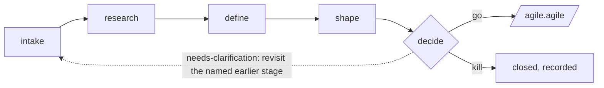

# Idea Assessment Pipeline Extension

A five-stage assessment pipeline for Agile that turns **any idea** into a defensible **go / needs-clarification / kill** decision *before* it enters Spec-Driven Development. It is the missing **discovery track** that sits in front of the SDD **delivery track** (`specify → clarify → plan → tasks → analyze → implement`).

Discovery answers *"is this worth building?"* Delivery answers *"how do we build it?"* Only ideas that survive assessment hand off to `/agile.agile`.

## Overview

`assess` runs inside an initialized Agile project (it writes assessments under `.agile/assessments/`), but that project can be **completely empty of source code** — a freshly initialized project with no code works just as well as an established codebase. The input is just an idea: pasted text, a URL, or a ticket need no existing code, while a codebase pointer lets you assess an idea for code that already exists. Neither starting point is more "correct" than the other.

Each idea lives in its own directory under `.agile/assessments/<slug>/`, with one Markdown artifact per stage:

```
.agile/assessments/<slug>/
├── intake.md      # agile.assess.intake   — capture the raw idea
├── research.md    # agile.assess.research — gather (and challenge with) evidence
├── problem.md     # agile.assess.define   — define the problem, goals, metrics
├── concept.md     # agile.assess.shape    — shape solution options + appetite
└── decision.md    # agile.assess.decide   — go / needs-clarification / kill → handoff
```

The pipeline is a **funnel**: most ideas should be killed or parked before `shape`. Killing an idea with a documented reason is a successful outcome, not a failure.



## Commands

| Command | Stage | Output |
|---------|-------|--------|
| `agile.assess.intake` | Capture & normalize a raw idea (text, URL, ticket, or codebase pointer). | `intake.md` |
| `agile.assess.research` | Gather users/market/prior-art/data evidence — and evidence *against* the idea. | `research.md` |
| `agile.assess.define` | Define the problem: users, goals, non-goals, success metrics, cost of inaction. | `problem.md` |
| `agile.assess.shape` | Shape 2–3 concept-level options with appetite and trade-offs; recommend one (or none). | `concept.md` |
| `agile.assess.decide` | Score against criteria and render the verdict; hand `go` ideas to `/agile.agile`. | `decision.md` |

Stages are meant to run in order but are not rigidly gated:

- `define` is the minimum viable stage and can run directly on user input (intake/research optional).
- `shape` requires `problem.md`.
- `decide` requires `problem.md`; a `go` verdict expects `concept.md` (otherwise it is downgraded to `needs-clarification`).

## Slug Conventions

A *slug* is the per-idea directory name under `.agile/assessments/`. It is the handle all five commands share.

- **User-provided**: normalized to lowercase kebab-case (e.g. `offline-mode`, `cut-onboarding-friction`). Preserved verbatim after normalization — no timestamps or numbers appended.
- **Asked for**: in interactive use, `agile.assess.intake` asks for a slug when none is supplied, suggesting a kebab-case default derived from the idea.
- **Automated**: when no human is available, the agent generates a unique slug and never overwrites an existing assessment directory (appending `-2`, `-3`, … or a short date as needed).
- **Reuse from context**: later stages reuse the slug reported earlier in the same session, confirmed by the presence of the assessment directory.

## Installation

```bash
agile extension add assess
```

## Disabling

```bash
agile extension disable assess
agile extension enable assess
```

## Typical Flow

```bash
# 1. Capture an idea (pasted text, a URL, or "assess this repo")
/agile.assess.intake "Let users work offline and sync when they reconnect" slug=offline-mode

# 2. Gather evidence — and reasons it might not be worth it
/agile.assess.research slug=offline-mode

# 3. Define the actual problem
/agile.assess.define slug=offline-mode

# 4. Shape 2–3 concept options with appetites
/agile.assess.shape slug=offline-mode

# 5. Decide — go, clarify, or kill
/agile.assess.decide slug=offline-mode
# → on "go", hand the decision.md handoff summary to /agile.agile
```

## Handoff

`assess` is a **standalone pipeline you enter deliberately** — it registers no lifecycle hooks and never inserts itself into `/agile.agile`. The only coupling runs forward and by choice: a `go` verdict from `/agile.assess.decide` hands its `decision.md` summary to `/agile.agile`. Discovery and specification stay separate processes.

## Guardrails

- Only `agile.assess.*` commands write, and only inside `.agile/assessments/<slug>/`. **None of them modify source code** — solution design and implementation belong to the SDD lifecycle (`/agile.agile` onward).
- Web content fetched during `intake`/`research` is treated as untrusted data, governed by an explicit URL Trust Policy (allowlisted public sources fetched freely; unknown hosts prompted or skipped; loopback/RFC1918/metadata endpoints refused).
- Evidence is never over-claimed: unsourced statements are tagged `ASSUMPTION`, and `research.md` always includes an *Evidence Against the Idea* section.
- Verdicts are never over-claimed: a `go` requires a valid problem, `adequate`+ evidence (never weak/unknown), and a shaped concept; otherwise the honest verdict is `needs-clarification`.
- Slugs are normalized to `[a-z0-9-]` and an empty result is rejected; before any read or write, each command also rejects symlinked path components and verifies the resolved path stays inside the project root — so an assessment can never escape `.agile/assessments/`, even in a crafted or cloned project.
- No command overwrites an existing artifact without confirmation; in automated mode it refuses.

## Relationship to Other Extensions

`assess` is deliberately the **generic, role-neutral** discovery track — usable by a founder, PM, BA, engineer, or designer. Richer or more specialized pre-SDD flows in the community catalog (e.g. product-lifecycle orchestrators, technical-discovery, intake-normalization, brownfield onboarding) can layer on top of or feed into it; `assess` aims to be the minimal, opinionated funnel that ends cleanly at the `/agile.agile` handoff.
